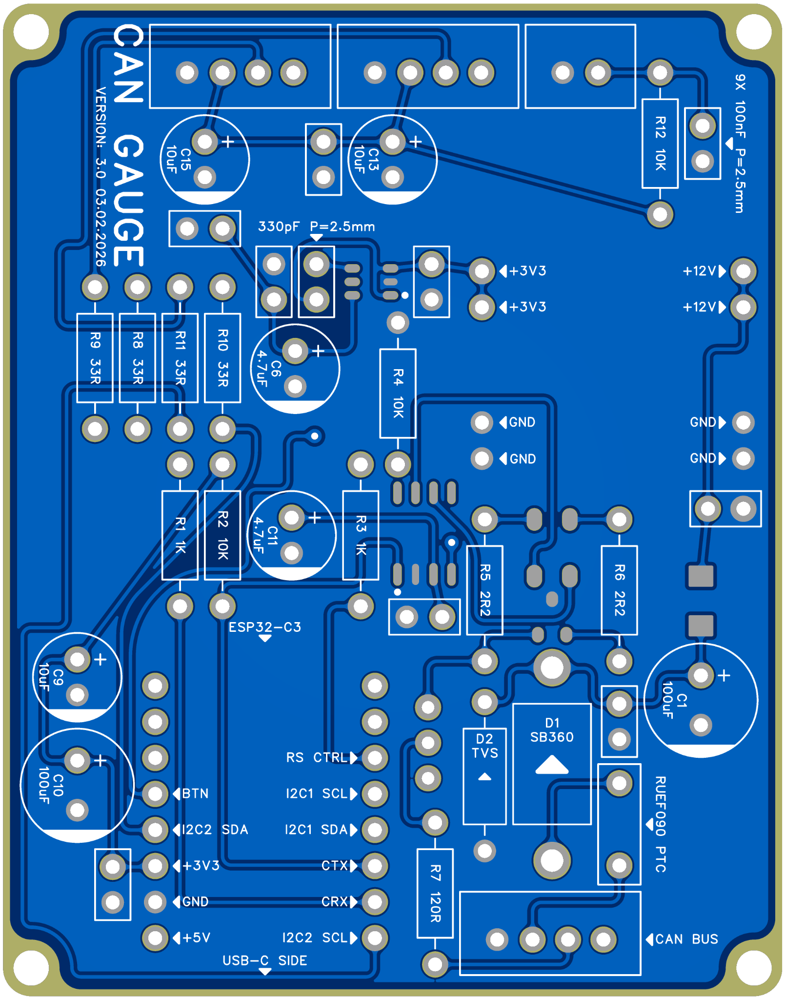

# AXION MicroCANgauge (firmware)

Small dual‑OLED CAN gauge for **MegaSquirt** ECUs.

This repository contains the **ESP32‑C3 firmware** that listens to MegaSquirt **Simplified Dash Broadcast (SDB)** frames and renders a compact gauge UI.

## Compatibility contract (non‑negotiable)
The firmware expects **Simplified Dash Broadcast** to be:

- **Enabled**
- **Mode: Automatic (standard)**
- **Base CAN ID: 1512 (0x5E8)**

If you use **Advanced** mode and change base IDs / layout, your frames will not match the included DBC and decoding will fail.

> User‑configurable items in this project are intentionally limited:
> - Sensor 1 / Sensor 2 scaling and selection (via Wi‑Fi portal)
> - UI / display preferences
> Everything else assumes “SDB Automatic”.

## What’s in here
- CAN/TWAI receiver + SDB decoder (MegaSquirt)
- Dual I2C OLED UI (U8g2)
- Wi‑Fi configuration portal (AP)
- NVS persistence for settings
- Optional OTA update path (if enabled in build/profile)

## User manual (interactive HTML flipbook)

The end‑user manual for the **Action MicroCANgauge** is provided as interactive HTML flipbooks (stored in `docs/`):

- **English:** [`docs/AXION_Flipbook_v1_3_1_EN_FINAL.html`](docs/AXION_Flipbook_v1_3_1_EN_FINAL.html)
- **Français:** [`docs/AXION_Flipbook_v1_3_1_FR_FINAL.html`](docs/AXION_Flipbook_v1_3_1_FR_FINAL.html)

Printable / shareable PDFs (screen‑friendly portrait):

- **English (PDF):** [`docs/AXION_MCG_DOC_v1_3_EN_SCREEN_PORTRAIT.pdf`](docs/AXION_MCG_DOC_v1_3_EN_SCREEN_PORTRAIT.pdf)
- **Français (PDF):** [`docs/AXION_MCG_DOC_v1_3_FR_SCREEN_PORTRAIT.pdf`](docs/AXION_MCG_DOC_v1_3_FR_SCREEN_PORTRAIT.pdf)

### Quick access (GitHub Pages)

Recommended config: **Settings → Pages → Deploy from a branch → Branch: `main` → Folder: `/docs`**.  
With that setup, the flipbooks open here:

- EN: `https://axionteamqc.github.io/AXION-microCANgauge-firmware/AXION_Flipbook_v1_3_1_EN_FINAL.html`
- FR: `https://axionteamqc.github.io/AXION-microCANgauge-firmware/AXION_Flipbook_v1_3_1_FR_FINAL.html`

> If the repository name is different, replace `AXION-microCANgauge-firmware` in the URLs above with your repo name.

### Offline (download + open locally)

- EN (raw): `https://raw.githubusercontent.com/axionteamqc/AXION-microCANgauge-firmware/main/docs/AXION_Flipbook_v1_3_1_EN_FINAL.html`
- FR (raw): `https://raw.githubusercontent.com/axionteamqc/AXION-microCANgauge-firmware/main/docs/AXION_Flipbook_v1_3_1_FR_FINAL.html`

- EN PDF (raw): `https://raw.githubusercontent.com/axionteamqc/AXION-microCANgauge-firmware/main/docs/AXION_MCG_DOC_v1_3_EN_SCREEN_PORTRAIT.pdf`
- FR PDF (raw): `https://raw.githubusercontent.com/axionteamqc/AXION-microCANgauge-firmware/main/docs/AXION_MCG_DOC_v1_3_FR_SCREEN_PORTRAIT.pdf`

  

## Media / gallery
A few quick reference images (renders + PCB review photos). Full set in `media/README.md`.

  
  
  

  
  
  

## Build / flash
**Tooling:** PlatformIO.

Typical workflow (example):
- Open this folder in VSCode + PlatformIO
- Build: `pio run -e esp32c3_release`
- Upload: `pio run -e esp32c3_release -t upload`

> `platformio_local.ini` is ignored by git by design (local machine overrides).

## Security note
The Wi‑Fi portal is designed for **local bench / local vehicle setup**, not hostile networks.
It is **not** an authenticated admin interface. Treat it accordingly.

## Repository layout (high level)
- `src/` — firmware source
- `test/` — small unit tests
- `hardware_review/` — PCB photos + schematic (for review; no Gerbers)
- `docs/` — documentation (incl. interactive user manuals / flipbooks)

## Hardware review package (no Gerbers)
See `hardware_review/` for PCB TOP/BOTTOM photos and schematic exports (SVG + PDF). Gerbers and full CAD projects are intentionally not published.

## License
- **Code:** GNU GPLv3 (see `LICENSE`)
- **Documentation / media / hardware review files:** **All rights reserved**, unless explicitly stated otherwise (see `NOTICE.md`)

## Credits
- Hardware schematic/PCB: **Petr**
- Enclosure 3D design: **Jean**
- Software: produced via iterative AI‑assisted development with human prompt orchestration and bench testing.
